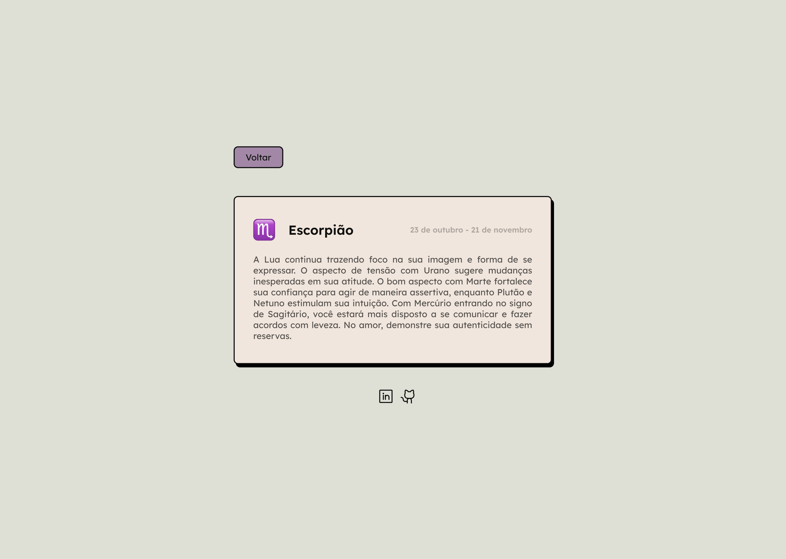

# Aplicativo dos Signos do Zodíaco

## Descrição

Este projeto foi desenvolvido para o Curso Superior Tecnológico em Análise e Desenvolvimento de Sistemas. É uma aplicação web que fornece informações sobre os signos do zodíaco e horóscopos diários por meio de scraping de dados da web.

<div style="display: flex; gap: 2rem; justify-content: center;">
    
    
</div>

## Funcionalidades

- Exibe os signos do zodíaco com seus símbolos, nomes e intervalos de datas.
- Recupera e mostra o horóscopo diário para um signo selecionado.
- Interface amigável com design responsivo utilizando Bootstrap 5.2.
- Validação de entrada do usuário para garantir que a data seja inserida corretamente.

## Tecnologias Utilizadas

- **PHP**: Linguagem de script do lado do servidor para desenvolvimento web.
- **Bootstrap 5.2**: Framework para criação de designs responsivos.
- **HTML/CSS**: Linguagens de marcação e estilo para estruturar e apresentar o conteúdo.
- **Figma**: Ferramenta utilizada para desenhar a interface da aplicação.
- **Web Scraping**: Técnicas usadas para extrair dados de sites externos.

## Instalação

Para configurar este projeto localmente, siga estes passos:

1. Clone este repositório:

```bash
git clone https://github.com/GiuliaMarcela/php-zodiac-project.git
```

2. Navegue até o diretório do projeto:

```bash
cd php-zodiac-project
```

3. Certifique-se de que o XAMPP esteja instalado e em execução. Coloque a pasta do projeto no diretório htdocs da sua instalação do XAMPP.
4. Acesse a aplicação pelo seu navegador web em:

```bash
  http://localhost/zodiac/
```

### Uso

1. Insira sua data de nascimento no campo de entrada.
2. Clique no botão "Enviar" para descobrir seu signo do zodíaco e ver seu horóscopo diário.
